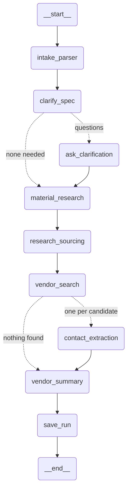

# Architecture

## Three components, deliberately separate

| | Owns | Lives in |
| --- | --- | --- |
| **The agent** | Domain logic: what a material is, what makes a vendor credible, what a contact must satisfy before it ships | `src/procurement_agent/` |
| **LLMRoute** | Which model serves a call, what happens when it fails, what quota is left | `LLMRoute/` |
| **SearchRoute** | Which search provider answers, fallback between them, monthly quota | `SearchRoute/` |

The split is the point. Provider routing is a general problem with nothing to do
with procurement, and mixing it into the graph is how the first version ended up
with a hand-rolled fallback chain, a token-aware rate limiter and a provider YAML
that all had to be maintained alongside the domain work. The agent now states a
*task tier* and a *capability* and knows nothing about who serves them.

What the agent keeps is everything a router could not know: that a designation
must appear in a retrieved source before it can be trusted, that a page selling
bar by the inch is not a supplier for a 150 kg order, that a contact which
cannot be found on the page it claims to come from must be dropped.

## The graph



Regenerate with `build_graph().compile().get_graph().draw_mermaid()` rather than
editing by hand. `draft_outreach_email` is omitted above: it is a separate entry
point invoked against a finished session, not part of the research pass.

| Node | Does | Spends |
| --- | --- | --- |
| `intake_parser` | Free text → `MaterialSpec` | 1 LLM call (tier B) |
| `clarify_spec` | Decides what must be asked. **Does not ask.** | 1 reference lookup + 1 LLM call (tier B) |
| `ask_clarification` | Suspends for the answer, folds it into the spec | 1 LLM call (tier B) |
| `material_research` | Designations and synonyms, **verified against sources** | 2 searches + 1 LLM call (tier S) |
| `research_sourcing` | Mines papers for named suppliers | up to 2 academic searches + 1 LLM call (tier B) |
| `vendor_search` | Builds queries, finds candidates, fills page text | up to 6 searches + extraction |
| `contact_extraction` | One candidate → one verified lead. **Fans out.** | 1 LLM call per vendor (tier B), crawling is free |
| `vendor_summary` | Deduplicate and rank. No model involved. | nothing |
| `save_run` | Archive the run and its trace | nothing |

`contact_extraction` is the expensive node — one call per vendor, up to twelve,
and the only one that sees page text. That is why it runs on tier B, where a
local Ollama endpoint can absorb it for free.

### Why `clarify_spec` and `ask_clarification` are separate

A node containing `interrupt()` is **re-executed from the top** when the answer
arrives. So anything non-deterministic inside it can reach a different
conclusion the second time.

That was not theoretical. When they were one node, a resume that had failed once
was retried, the retry landed on a different provider, that provider decided no
clarification was needed, and the early-return path discarded the buyer's answer
in silence. The run then searched for "Hastelloy" — a family of dozens of alloys
— instead of the "Hastelloy C-276" that had just been typed.

Deciding is now committed to `pending_questions` before anyone is interrupted,
so the replayed half reads the decision back rather than remaking it.

## State versus run config

Two places, and the distinction is load-bearing.

**Checkpointed state** (`graph/state.py`) is everything that must survive a
process restart: the spec, the research, the candidates, the leads. It is
serialised into Postgres, so everything in it must be serialisable — which is
why SearchRoute's result dataclasses are projected into `VendorCandidate` rather
than carried directly.

**Run config** (`graph/build.run_config`) carries the two objects that *cannot*
be checkpointed because they hold an `asyncio.Lock`:

- the run's `SessionBudget`, so one ceiling governs every node
- the `RunTrace`, plus the `callbacks` list that feeds it

Nodes reach both through `graph/context.py` rather than indexing into
`config["configurable"]` themselves.

Fan-out branches receive a `Send()` payload rather than full state, but they do
receive `config` — which is how twelve concurrent `contact_extraction` branches
share one budget allocation instead of taking twelve.

## A request, end to end

```
POST /sessions                    allocate a thread id; nothing runs
POST /sessions/{id}/messages      run_config() builds the budget + trace
    graph.astream(...)            SSE: node_end per node
        intake_parser             spec
        clarify_spec              questions, or straight through
        ask_clarification         interrupt() -> checkpoint -> suspend
                                  SSE: interrupt, stream ends
POST /sessions/{id}/resume        Command(resume=...), budget seeded from state
        ...                       material_research -> ... -> save_run
                                  SSE: final
```

The suspend is real: the checkpoint is in Postgres, so the answer can arrive an
hour later from a different process. `--resume` in the CLI exists mainly to
prove that.

## Where the money goes

Two budgets, and conflating them is a mistake worth naming.

- **SearchRoute's quota ledger** — monthly, per provider, shared by everything
  on the machine. Persisted at `$XDG_STATE_HOME/searchroute/quota.json`.
- **`SessionBudget`** — one run's ceiling, so a single fan-out cannot consume
  the month in one request. Lives in run config, seeded from state on resume.

The run budget counts **metered searches, not provider credits**. Provider units
are not comparable — the same content search bills 2 on Tavily, 100 on Exa and 0
on arXiv — so a ceiling denominated in them means "twelve searches" against one
provider and nothing at all against another.

The LLM side has its own ledger (LLMRoute's `UsageLedger`, at
`llm_ledger_path`), which is why that file needs a volume in Docker: without it
every restart believes the daily quota is unspent and rediscovers the truth
through 429s.

## Further reading

- [design-decisions.md](design-decisions.md) — why the code is shaped this way
- [fallbacks.md](fallbacks.md) — what happens when each part fails
- [operations.md](operations.md) — configuring and running it
- [../API_CONTRACT.md](../API_CONTRACT.md) — the HTTP surface
